<p align="center">
  
</p>

<h1 align="center">Game Zone · ft_transcendence</h1>

<p align="center">
  Play together. Chat with friends. Track your progress.
</p>

<p align="center">
  <strong>Next.js · TypeScript · Fastify · Socket.IO · SQLite · Docker</strong>
</p>

---

Game Zone is a multiplayer web project for the 42 curriculum. It brings Pong, 3D Parcheesi, live chat, and player statistics into one place. Players can create an account, connect with friends, and play in their browser.

The backend is split into small services. Each service handles one part of the app, such as accounts, chat, or games. Docker Compose runs the app and its monitoring tools together.

[Features](#features) · [Screenshots](#screenshots) · [Architecture](#architecture) · [Getting started](#getting-started) · [Commands](#useful-commands) · [Troubleshooting](#troubleshooting)

## Features

| Area | What you can do |
| --- | --- |
| **Pong** | Play locally, play online, invite a friend, or join a tournament. Change game settings, including the paddle and ball. |
| **3D Parcheesi** | Play locally or online, join a lobby, and choose a visual theme. The board uses Babylon.js. |
| **Chat** | Send live messages, share files, send voice messages, and use audio or video calls. |
| **Accounts** | Register with email verification, sign in with Google, and set up two-factor authentication. |
| **Friends and profiles** | Manage friends, block users, and update your profile and avatar. |
| **Dashboard** | View game history, player statistics, and rankings. |
| **Monitoring** | View service metrics in Grafana and Prometheus, and search application logs in Kibana. |

## Screenshots

All 21 screenshots from the app, grouped by feature. Click any image to view it at full size.

### Games

<table>
  <tr>
    <td width="50%" align="center">
      <strong>Choose a game</strong><br>
      <a href="docs/screenshots/game-selection.png">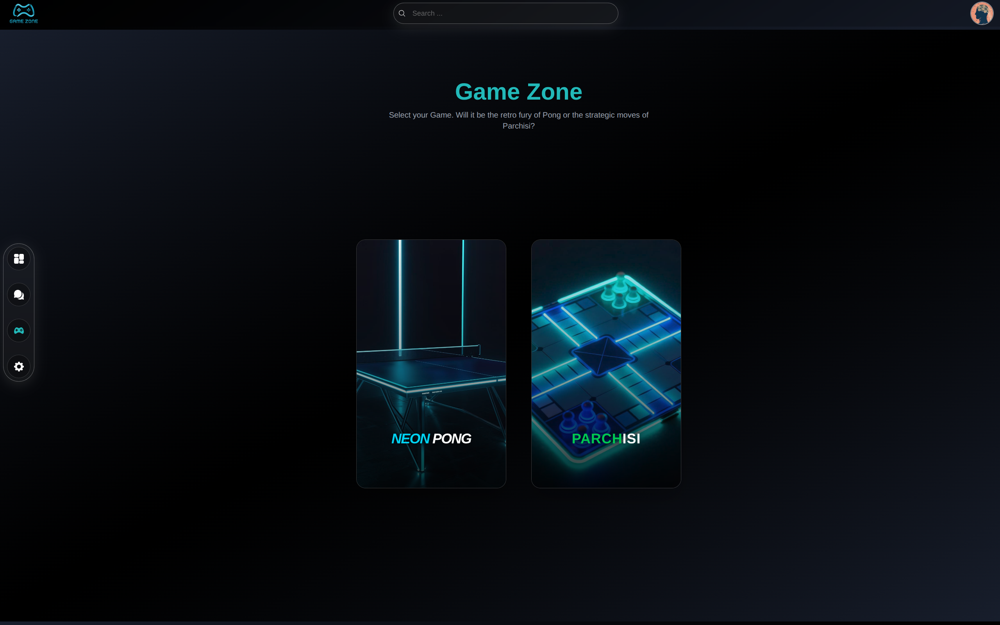</a>
      <p>Pick Pong or Parcheesi from the games page.</p>
    </td>
    <td width="50%" align="center">
      <strong>Pong match</strong><br>
      <a href="docs/screenshots/pong-match.png">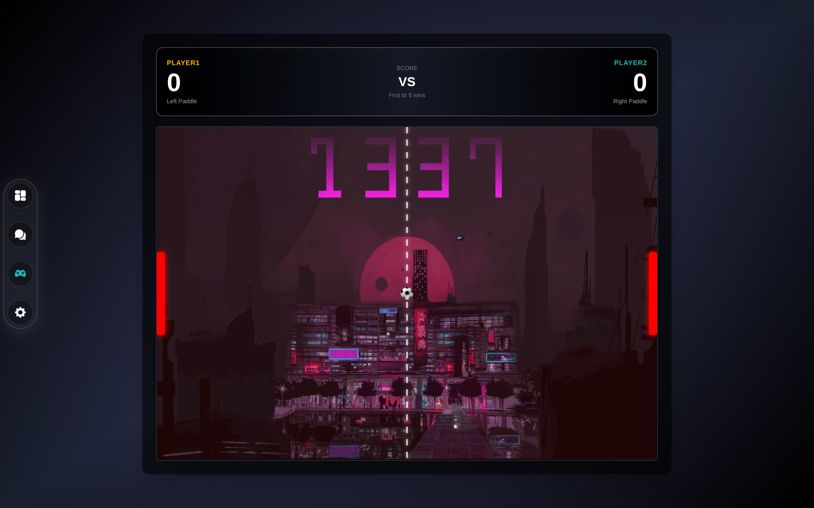</a>
      <p>A local match with a custom table, red paddles, and a football.</p>
    </td>
  </tr>
  <tr>
    <td width="50%" align="center">
      <strong>Four-player Parcheesi</strong><br>
      <a href="docs/screenshots/parcheesi-four-players.png">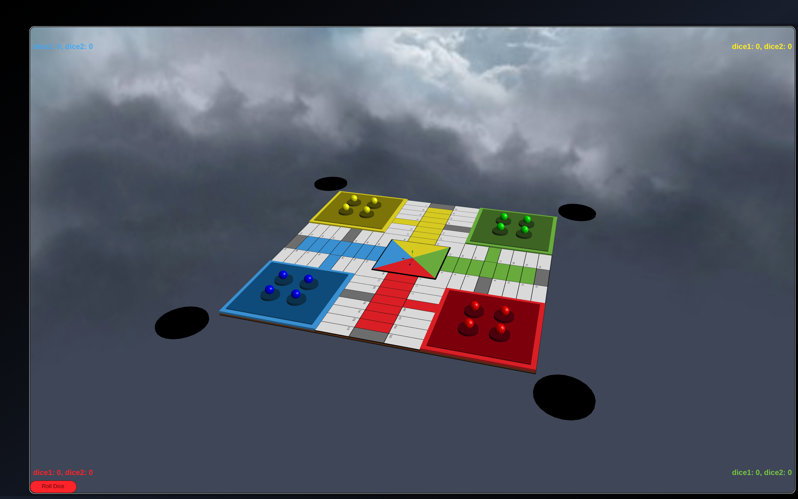</a>
      <p>The 3D board with four sets of pieces.</p>
    </td>
    <td width="50%" align="center">
      <strong>Two-player Parcheesi</strong><br>
      <a href="docs/screenshots/parcheesi-two-players.png">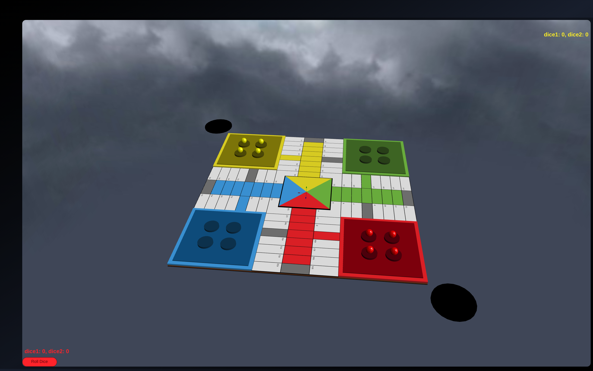</a>
      <p>The 3D board with two sets of pieces.</p>
    </td>
  </tr>
</table>

### Pong customization

<table>
  <tr>
    <td width="50%" align="center">
      <strong>Pong settings preview</strong><br>
      <a href="docs/screenshots/pong-settings-preview.png"></a>
      <p>Another capture of the classic table preview and game options.</p>
    </td>
    <td width="50%" align="center">
      <strong>Pong settings</strong><br>
      <a href="docs/screenshots/pong-settings.png">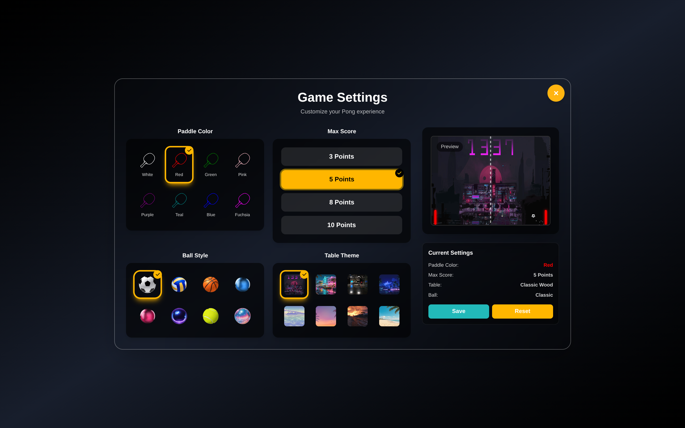</a>
      <p>Choose the paddle color, ball style, maximum score, and table theme.</p>
    </td>
  </tr>
  <tr>
    <td width="50%" align="center" colspan="2">
      <strong>Another Pong theme</strong><br>
      <a href="docs/screenshots/pong-sunset-theme.png">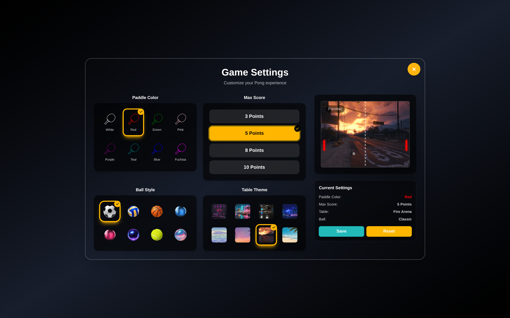</a>
      <p>Preview the sunset table before saving your settings.</p>
    </td>
  </tr>
</table>

### Accounts and profile settings

<table>
  <tr>
    <td width="50%" align="center">
      <strong>Sign in</strong><br>
      <a href="docs/screenshots/sign-in.png">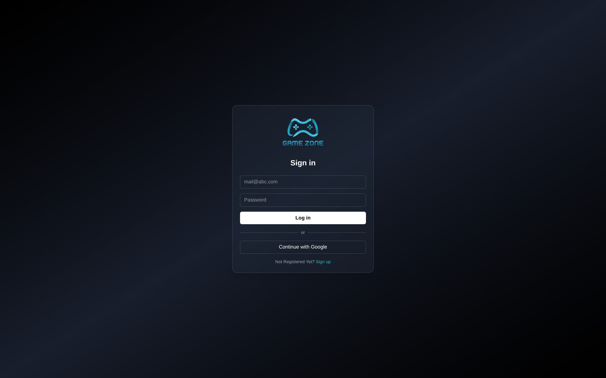</a>
      <p>Sign in with your email or Google account.</p>
    </td>
    <td width="50%" align="center">
      <strong>Create an account</strong><br>
      <a href="docs/screenshots/sign-up.png">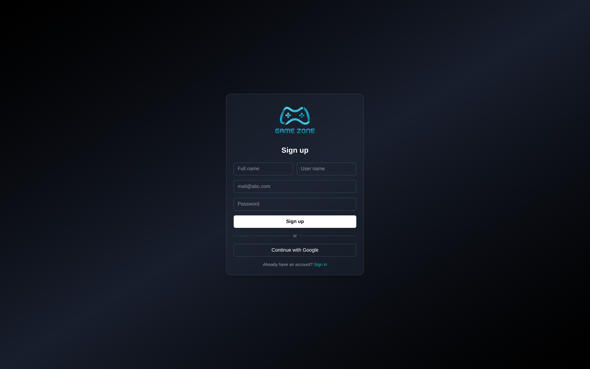</a>
      <p>Register a new Game Zone account.</p>
    </td>
  </tr>
  <tr>
    <td width="50%" align="center">
      <strong>Email verification</strong><br>
      <a href="docs/screenshots/email-verification.png">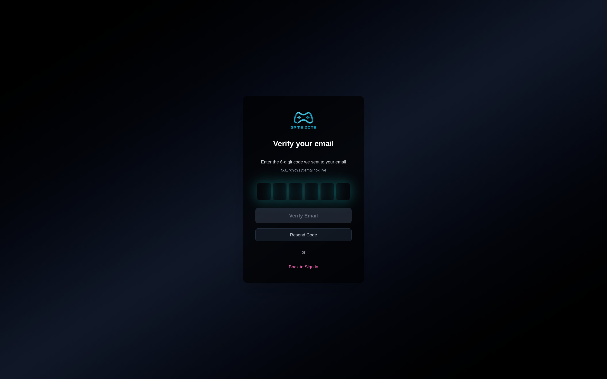</a>
      <p>Enter the six-digit email code or request a new code.</p>
    </td>
    <td width="50%" align="center">
      <strong>Profile settings</strong><br>
      <a href="docs/screenshots/profile-settings.png">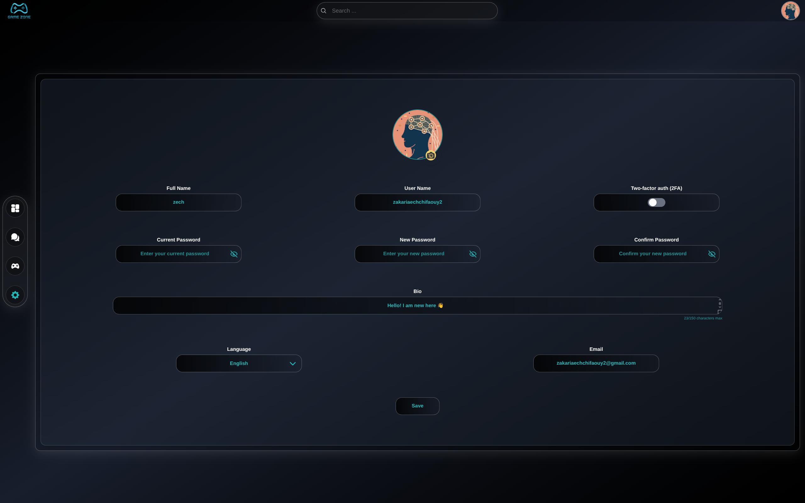</a>
      <p>Update your profile, language, password, and two-factor authentication.</p>
    </td>
  </tr>
</table>

### Dashboards and friends

<table>
  <tr>
    <td width="50%" align="center">
      <strong>New player dashboard</strong><br>
      <a href="docs/screenshots/dashboard-new-player.png">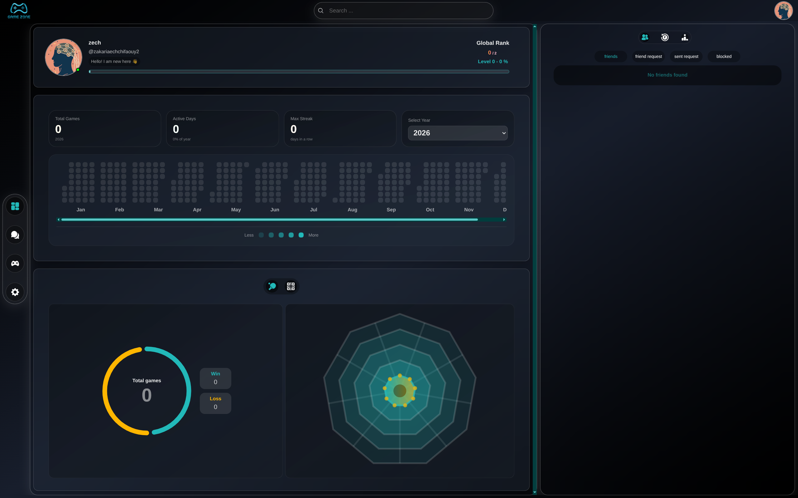</a>
      <p>See your profile, activity calendar, and game statistics.</p>
    </td>
    <td width="50%" align="center">
      <strong>Player statistics</strong><br>
      <a href="docs/screenshots/dashboard-statistics.png">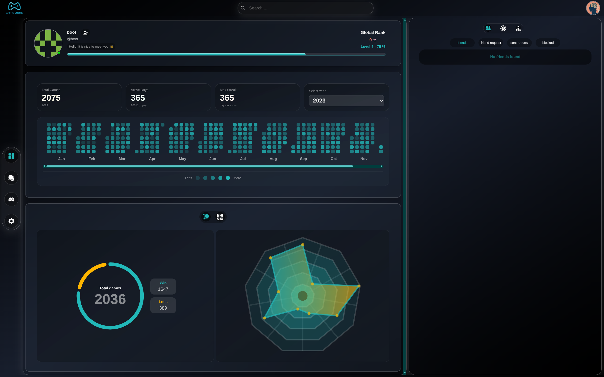</a>
      <p>View activity, wins, losses, and the skill chart.</p>
    </td>
  </tr>
  <tr>
    <td width="50%" align="center">
      <strong>Friend requests</strong><br>
      <a href="docs/screenshots/friend-request.png">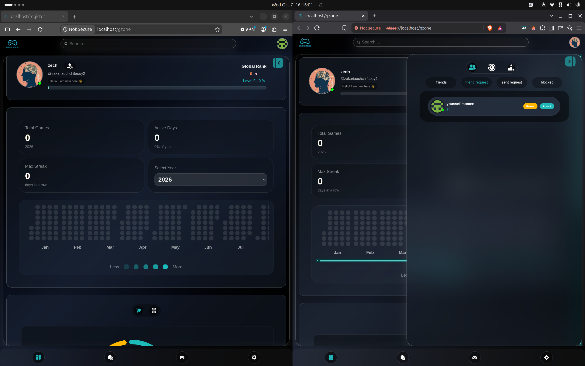</a>
      <p>Accept or refuse a friend request from the dashboard.</p>
    </td>
    <td width="50%" align="center">
      <strong>Friends list</strong><br>
      <a href="docs/screenshots/friends-list.png">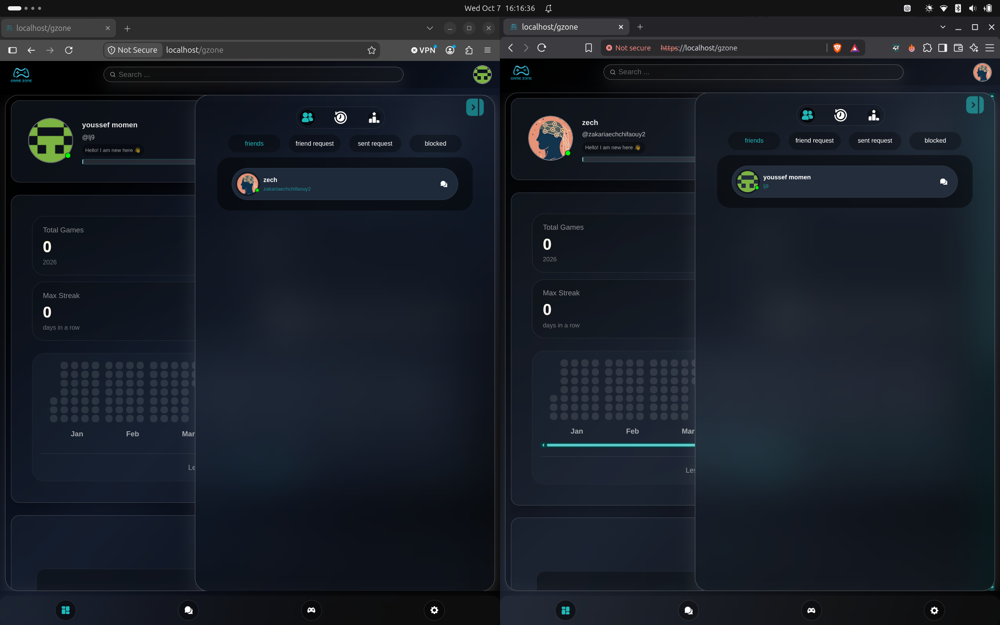</a>
      <p>Both users can see each other in their friends list.</p>
    </td>
  </tr>
</table>

### Chat, calls, and sharing

<table>
  <tr>
    <td width="50%" align="center">
      <strong>Chat</strong><br>
      <a href="docs/screenshots/chat.png">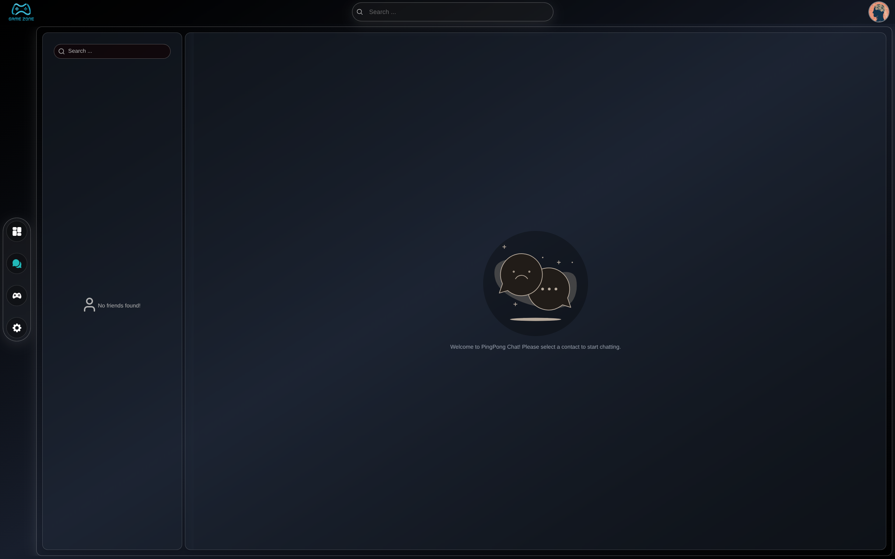</a>
      <p>Choose a friend to start a conversation. This capture shows the empty chat screen.</p>
    </td>
    <td width="50%" align="center">
      <strong>Chat contacts</strong><br>
      <a href="docs/screenshots/chat-contacts.png">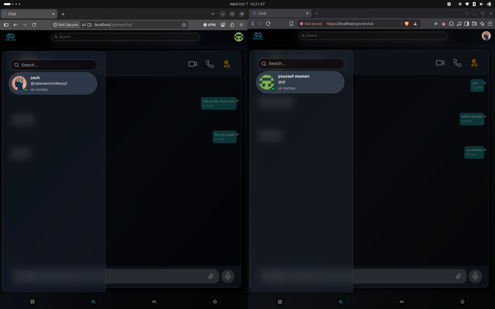</a>
      <p>Open the contact list to see a friend and their latest message.</p>
    </td>
  </tr>
  <tr>
    <td width="50%" align="center">
      <strong>Live conversation</strong><br>
      <a href="docs/screenshots/chat-conversation.png">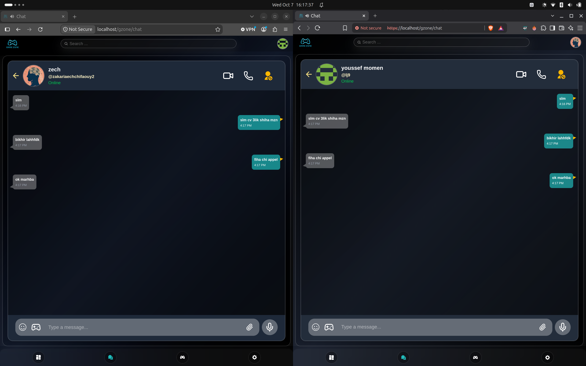</a>
      <p>The same conversation shown from both user accounts.</p>
    </td>
    <td width="50%" align="center">
      <strong>Audio call and block dialog</strong><br>
      <a href="docs/screenshots/audio-call-and-block.png">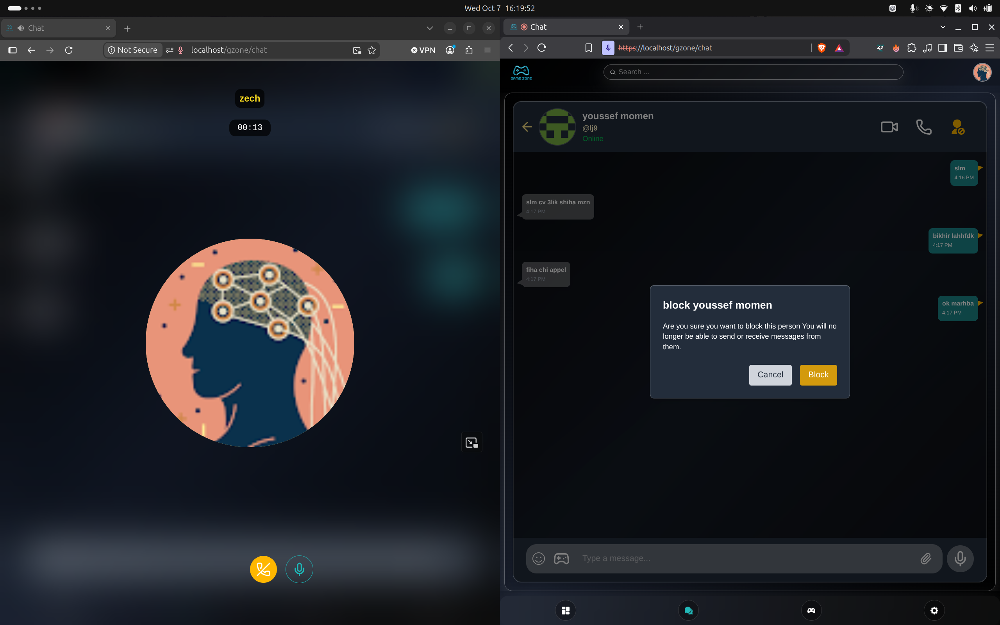</a>
      <p>An audio call on the left and a block confirmation on the right.</p>
    </td>
  </tr>
  <tr>
    <td width="50%" align="center">
      <strong>Voice messages</strong><br>
      <a href="docs/screenshots/chat-voice-message.png">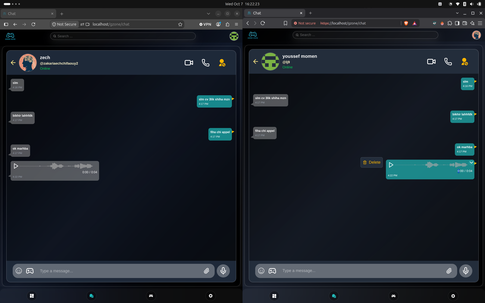</a>
      <p>A voice message appears in both conversations, with a delete option for the sender.</p>
    </td>
    <td width="50%" align="center">
      <strong>Images and emoji</strong><br>
      <a href="docs/screenshots/chat-media.png">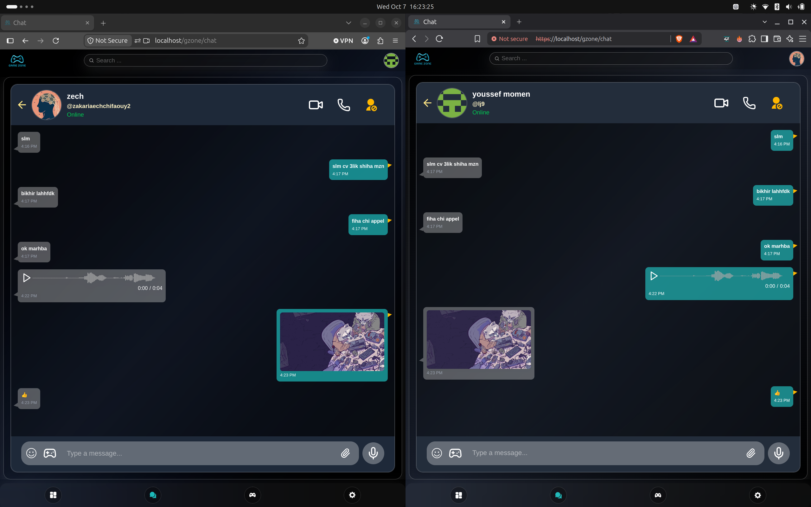</a>
      <p>Two users share text, a voice message, an image, and emoji.</p>
    </td>
  </tr>
</table>

## Architecture

Nginx is the entry point. It serves the frontend through a proxy and sends API requests and live connections to the gateway. The gateway routes them to the right backend service.

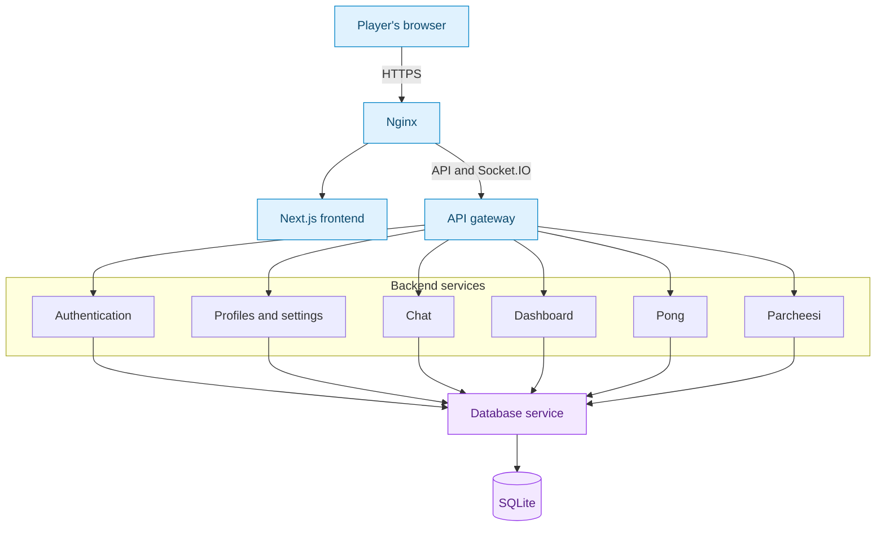
```mermaid
flowchart TD
    Browser[Player's browser] -->|HTTPS| Nginx[Nginx]
    Nginx --> Frontend[Next.js frontend]
    Nginx -->|API and Socket.IO| Gateway[API gateway]

    subgraph Backend[Backend services]
        Auth[Authentication]
        User[Profiles and settings]
        Chat[Chat]
        Dashboard[Dashboard]
        Pong[Pong]
        Parcheesi[Parcheesi]
    end

    Gateway --> Auth & User & Chat & Dashboard & Pong & Parcheesi
    Auth & User & Chat & Dashboard & Pong & Parcheesi --> DB[Database service]
    DB --> SQLite[(SQLite)]

    classDef entry fill:#e0f2fe,stroke:#0284c7,color:#0c4a6e
    classDef storage fill:#f3e8ff,stroke:#9333ea,color:#581c87
    class Browser,Nginx,Frontend,Gateway entry
    class DB,SQLite storage
```

### Technology stack

| Layer | Tools |
| --- | --- |
| Frontend | Next.js 15, React 19, TypeScript, Tailwind CSS 4 |
| 3D graphics | Babylon.js |
| Backend | Node.js, Fastify, TypeScript |
| Live communication | Socket.IO and WebRTC for calls |
| Database | SQLite with better-sqlite3 |
| Routing and HTTPS | Nginx and a Fastify API gateway |
| Containers | Docker and Docker Compose |
| Metrics | Prometheus, Grafana, Node Exporter |
| Logs | Filebeat, Logstash, Elasticsearch, Kibana |

### Backend services

These ports are internal to the Docker network. Open the app through Nginx, rather than connecting to each service directly.

| Service | Port | Purpose |
| --- | --- | --- |
| `gateway-service` | 5006 | Routes API requests and Socket.IO connections |
| `auth-service` | 5001 | Login, registration, email verification, and 2FA |
| `user-service` | 5004 | Profiles and account settings |
| `chat-service` | 5003 | Messages, uploads, and call signaling |
| `dashboard-service` | 5002 | Player statistics and history |
| `ping-pong-service` | 5500 | Pong matches and tournaments |
| `parcheesi-service` | 5555 | Parcheesi rooms and game state |
| `db-service` | 5000 | Shared database API |

## Getting started

### 1. Check the requirements

You need Git, Docker with the Compose plugin, and Make. Docker must be running. The containers install their own Node.js dependencies.

The monitoring setup uses Linux host paths, including `/proc`, `/sys`, and `/var/lib/docker/containers`. It is designed for a Linux Docker host; other systems may need changes to these mounts.

### 2. Clone the project

```bash
git clone https://github.com/zech-chi/ft_trancendance_42_network.git
cd ft_trancendance_42_network
```

### 3. Configure your environment

Review the root `.env` file and enter values for your own setup. There is currently no `.env.example`. Keep real passwords and private keys out of documentation and shared changes.

| Setting | What to configure |
| --- | --- |
| `HOST` | The browser address of your app, such as `https://localhost` |
| `JWT_SECRETS` | A private signing secret shared by authentication and the gateway |
| `GOOGLE_CLIENT_ID`, `GOOGLE_CLIENT_SECRET` | Credentials for your Google OAuth application |
| `GOOGLE_CALLBACK` | The callback URL, such as `https://localhost/api/auth/login/google/callback`; register the same URL in Google OAuth |
| `MAIL_USER_SERVICE`, `MAIL_USER_PASSWORD` | Credentials for the Gmail SMTP account used to send verification emails |
| `GF_SECURITY_ADMIN_USER`, `GF_SECURITY_ADMIN_PASSWORD` | Your Grafana login |
| `GF_SERVER_ROOT_URL`, `GF_SERVER_SERVE_FROM_SUB_PATH` | Grafana's public URL and subpath setting; for local use, `https://localhost/grafana/` and `true` |
| `SERVER_PUBLICBASEURL`, `SERVER_BASEPATH`, `SERVER_REWRITEBASEPATH` | Kibana's public URL and routing settings; for local use, `https://localhost/kibana`, `/kibana`, and `true` |

The authentication service checks that the Google OAuth variables, `HOST`, and `JWT_SECRETS` are present at startup. Working email credentials are needed to complete email verification. Keep the other Elasticsearch, Kibana, and Logstash settings in `.env` aligned with the Compose services.

The repository also contains the original machine name, `e3r4p12.1337.ma`. For a local setup, update the `server_name` entries in `nginx/nginx.conf` to `localhost` and review `frontend/src/utils/Hostname.ts` for the same host choice. Rebuild after changing frontend source or Nginx configuration.

### 4. Build and start

Run these commands from the project root:

```bash
docker compose -p fullmerge config --quiet
make build
make up
make ps
```

The first build can take several minutes. Elasticsearch, Logstash, and Kibana may need extra time to become healthy.

### 5. Open the app

For a local setup, visit **[https://localhost](https://localhost)**.

Nginx creates a self-signed certificate during its build, so your browser will show a certificate warning for this local development site. HTTP requests redirect to HTTPS.

Create an account, verify your email, and sign in. Then open the games page to choose Pong or Parcheesi, or open chat to connect with friends.

## Useful commands

| Command | Action |
| --- | --- |
| `make build` | Build all application images |
| `make up` | Start the full stack in the background |
| `make ps` | Show container status |
| `make logs` | Follow all service logs |
| `make logs-auth-service` | Follow one service's logs |
| `make restart-chat-service` | Restart the chat service |
| `make build-frontend` | Rebuild the frontend image |
| `make up-frontend` | Start or recreate the frontend container |
| `make down` | Stop and remove containers and the Compose network |
| `make restart` | Stop the stack, then start it again |
| `make clean` | Remove containers, the network, and Compose-managed volumes; this deletes data stored in those volumes |

Use `make build-frontend` followed by `make up-frontend` to apply frontend changes. A restart alone does not rebuild an image.

## Monitoring and logs

The project has two monitoring flows: metrics show how services are running, and logs help explain what happened.

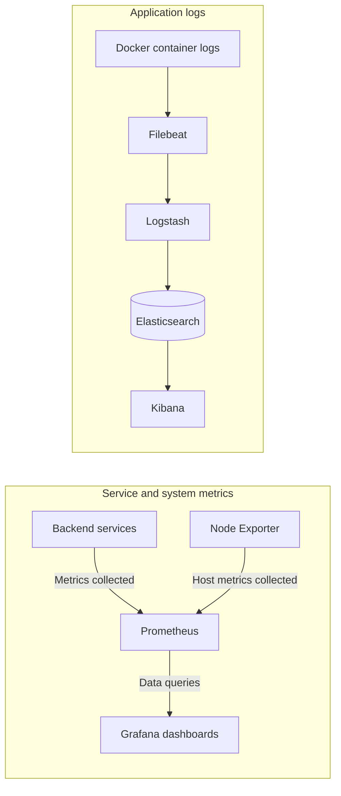
```mermaid
flowchart LR
    subgraph Metrics[Service and system metrics]
        Services[Backend services] -->|Metrics collected| Prometheus[Prometheus]
        Node[Node Exporter] -->|Host metrics collected| Prometheus
        Prometheus -->|Data queries| Grafana[Grafana dashboards]
    end

    subgraph Logs[Application logs]
        Containers[Docker container logs] --> Filebeat[Filebeat]
        Filebeat --> Logstash[Logstash]
        Logstash --> Elasticsearch[(Elasticsearch)]
        Elasticsearch --> Kibana[Kibana]
    end
```

After configuring the local URLs, open:

| Tool | Address | Purpose |
| --- | --- | --- |
| Grafana | [https://localhost/grafana/](https://localhost/grafana/) | View metrics dashboards |
| Prometheus | [https://localhost/prometheus/](https://localhost/prometheus/) | Query metrics and inspect scrape targets |
| Kibana | [https://localhost/kibana/](https://localhost/kibana/) | Explore and search logs |

Grafana provisioning is in `grafana/provisioning/`. Prometheus targets are in `prometheus_conf/prometheus.yml`. Log collection and processing are configured in `filebeat/` and `logstash/pipeline/`.

## Project structure

```text
.
├── backend/
│   ├── auth-service/         # Accounts and authentication
│   ├── User-Service/         # Profiles and settings
│   ├── chat-service/         # Chat, uploads, and call signaling
│   ├── dashboard-service/    # Statistics and history
│   ├── db-service/           # SQLite database and data routes
│   ├── gateway-service/      # API and Socket.IO routing
│   ├── parcheesi-service/    # Parcheesi game logic
│   └── ping-pong-service/    # Pong and tournaments
├── frontend/
│   ├── public/               # Images and game assets
│   └── src/                  # Pages, components, and client logic
├── nginx/                   # HTTPS and reverse proxy
├── grafana/                 # Dashboard provisioning
├── prometheus_conf/         # Metrics collection
├── filebeat/                # Container log collection
├── logstash/                # Log processing
├── docker-compose.yml       # Full stack configuration
└── Makefile                 # Common Docker commands
```

## Troubleshooting

| Problem | What to check |
| --- | --- |
| The website does not open | Run `make ps` and `make logs-nginx`. Check that ports 80 and 443 are available. |
| Login or Google sign-in fails | Check the authentication logs, OAuth credentials, callback URL, and `HOST`. |
| The verification email does not arrive | Check the spam folder and the Gmail SMTP credentials in `.env`. |
| A game or chat cannot connect | Check the related service logs and the gateway logs. Use the app's HTTPS address so requests go through Nginx. |
| Kibana or Nginx is still waiting | Check Elasticsearch and Kibana health with `make ps`. Their startup can take several minutes. |
| Changes are not visible | Rebuild the changed service, then run its `make up-...` command. |

**Database persistence needs attention:** the database service runs compiled code from `dist/`, and its SQLite path is relative to that code. Compose currently mounts `/app/src/db`, not `/app/dist/db`. Do not rely on that mount to preserve the running database when the container is recreated; align the database path and mount before keeping important data.

## Development checks

To check frontend code locally, use Node.js 22, matching the frontend Docker image:

```bash
cd frontend
npm install --legacy-peer-deps
npm run lint
npm run build
```

These commands check lint rules and the frontend build. They do not replace testing registration, chat, and multiplayer games in the full stack. Several backend packages still have placeholder `test` scripts, so there is no complete automated test suite documented here.
